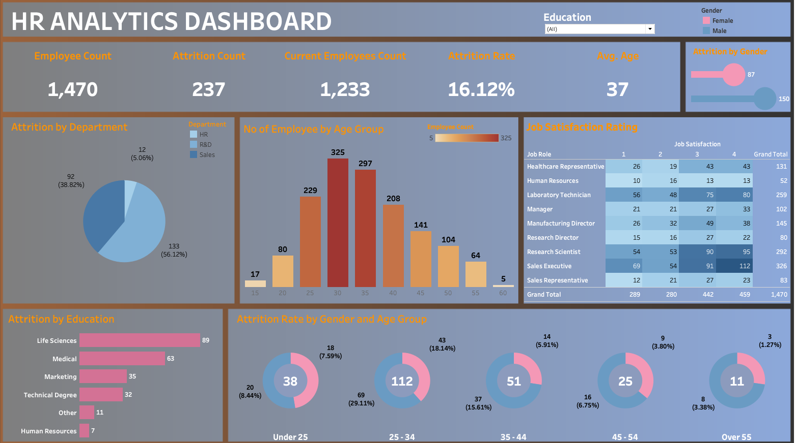

# HR Analytics Dashboard — Tableau

## Overview

This interactive Tableau dashboard analyzes employee attrition patterns across an organization of **1,470 employees**. It was built to surface actionable workforce insights across demographics, departments, job roles, and education backgrounds — helping HR teams identify where attrition is concentrated and why.

**Tool:** Tableau Desktop  
**Dataset:** IBM HR Analytics Employee Attrition Dataset (publicly available on Kaggle)  
**Focus Area:** People Analytics / HR Business Intelligence

---

## Key Metrics

| Metric | Value |
|---|---|
| Total Employees | 1,470 |
| Attrition Count | 237 |
| Current Employees | 1,233 |
| Attrition Rate | 16.12% |
| Average Employee Age | 37 |

---

## Dashboard Components

### 1. KPI Banner
Five headline metrics displayed prominently at the top for immediate executive-level readability — Employee Count, Attrition Count, Current Employees, Attrition Rate, and Average Age.

### 2. Attrition by Gender
A dot-plot chart comparing attrition volume between male (150) and female (87) employees, color-coded consistently throughout the dashboard using a pink/blue gender palette.

### 3. Attrition by Department
A pie chart breaking down attrition across three departments:
- **Sales** — 133 employees (56.12%) — highest attrition share
- **R&D** — 92 employees (38.82%)
- **HR** — 12 employees (5.06%)

### 4. Employee Count by Age Group
A histogram displaying the distribution of employees across age bins, revealing that the **30–36 age band** has the highest employee concentration, which also aligns with higher attrition risk.

### 5. Job Satisfaction Rating
A heatmap-style cross-tab showing satisfaction scores (1–4) by Job Role, allowing quick identification of which roles have the most dissatisfied employees. Notable findings:
- **Sales Executive** and **Research Scientist** have the highest headcounts and skew toward lower satisfaction scores (1–2)
- **Laboratory Technician** shows a wide spread across all satisfaction levels

### 6. Attrition by Education Field
A horizontal bar chart ranking attrition count by education background:
- Life Sciences — 89
- Medical — 63
- Marketing — 35
- Technical Degree — 32
- Other — 11
- Human Resources — 7

Employees from **Life Sciences and Medical backgrounds account for over 64%** of total attrition.

### 7. Attrition Rate by Gender and Age Group
A series of donut charts, one per age group, showing male vs. female attrition rate side by side. Key findings:
- **25–34** age group has the highest absolute attrition — 112 male, 69 female
- The **Under 25** group shows a high female attrition rate (7.59%) relative to its size
- Attrition drops significantly after age 45, suggesting better retention among tenured employees

---

## Key Insights

1. **Sales is the highest-risk department** — over half of all attrition originates from Sales, which likely reflects target pressure, compensation structures, or limited growth paths.

2. **Mid-career employees (25–34) are leaving the most** — this age band represents both the largest workforce segment and the highest attrition volume, making retention programs here highest priority.

3. **Life Sciences and Medical professionals are underretained** — despite being the largest talent pools, they account for the most departures. This may signal misalignment in role expectations or compensation benchmarking.

4. **Gender attrition gap** — male attrition (150) is significantly higher than female (87), though both genders show similar proportional patterns across age groups.

5. **Job satisfaction scores don't fully predict attrition** — roles like Research Scientist have high headcount and moderate satisfaction yet high attrition, suggesting factors beyond satisfaction (compensation, growth) are at play.

---

## Interactivity

- **Education Filter** (top) — filters the entire dashboard by employee education level
- **Age Bin Size control** — allows dynamic adjustment of histogram bin width for the Age Group chart

---

## How to View

1. Download the `.twbx` file from this repository
2. Open with **Tableau Desktop** (version 2022.1 or later recommended)

---

## Dataset

**Source:** HR Analytics Dataset  
**Raw Data:** [View Dataset (Google Sheets)](https://docs.google.com/spreadsheets/d/1-1Ldoe-DwZTL77tdMtRgZAIzeAzs0jh3/edit?gid=2089618187#gid=2089618187)  
**Records:** 1,470 employees  
**Features used:** Age, Gender, Department, Education Field, Job Role, Job Satisfaction, Attrition

---

## About

Built by **Harshitha Babu**  
Computer Engineering Graduate, SUNY Binghamton  
Data Science Intern | Aspiring Data Analyst / BI Developer  

[LinkedIn](https://www.linkedin.com/in/harshithababu/) • [GitHub](https://github.com/harshithababu02)
